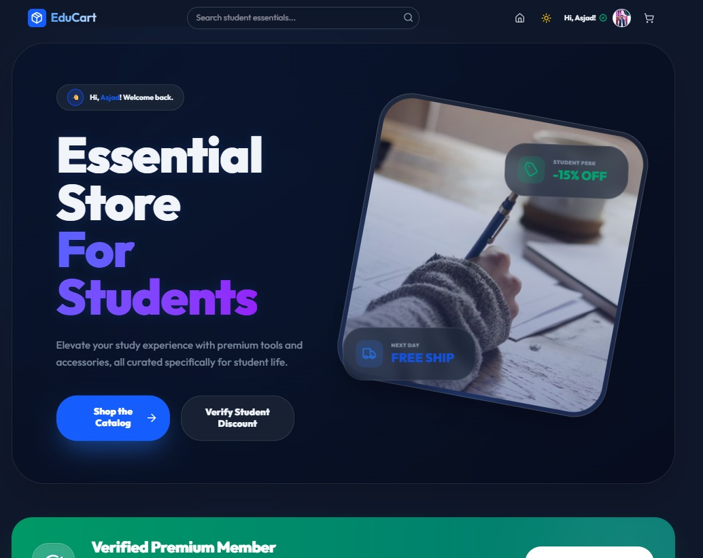
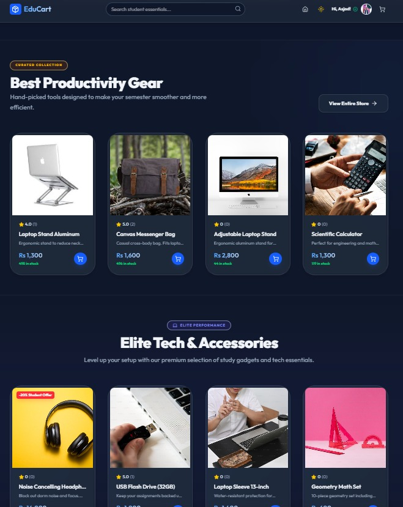
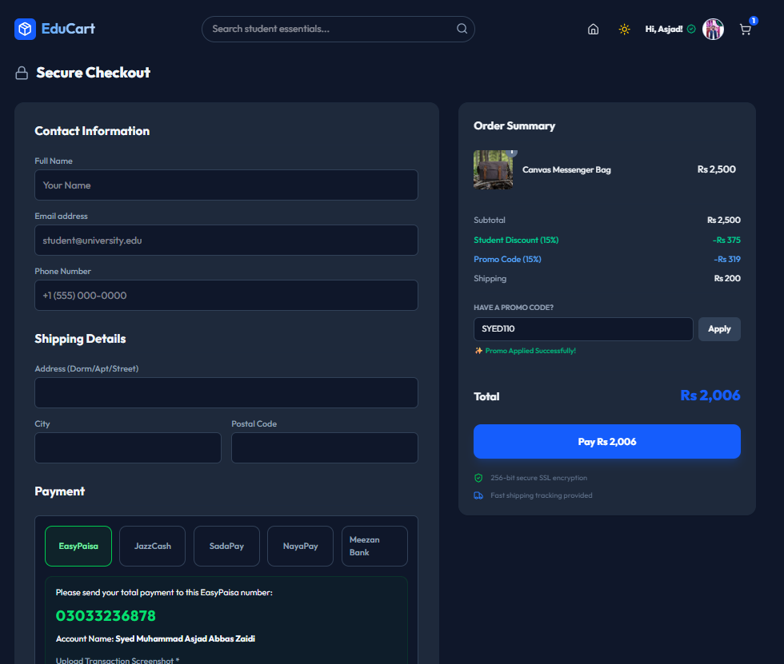
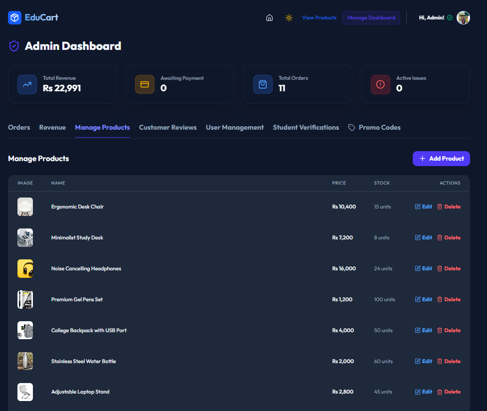
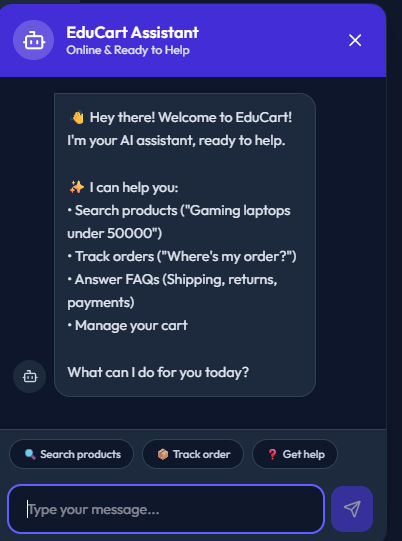

# EduCart – Full-Stack E-Commerce Platform

<p align="center">
  
</p>

Production-oriented full-stack e-commerce platform built with React.js, Node.js, Express, and MongoDB featuring scalable backend architecture, JWT authentication, AI-powered chatbot support, and SEO optimization.

## Overview

EduCart is a modern e-commerce platform designed for students and online shoppers with a focus on scalability, modular backend architecture, responsive UI, and production-ready workflows.

The platform includes secure authentication, intelligent product search, order management, AI chatbot assistance, SEO optimization, and an admin dashboard for managing products, users, and orders.

## Features

### E-Commerce System

* Product catalogue and category filtering
* Smart product search and recommendations
* Cart and checkout workflows
* Wishlist functionality
* Order tracking and purchase history
* Student-focused shopping experience

### Authentication & Security

* JWT-based authentication
* Protected routes and role-based access
* Password hashing using bcryptjs
* Secure API workflows
* Input validation and error handling

### AI Chatbot

* NLP-powered customer support chatbot
* Product recommendation system
* Natural language product queries
* Order tracking assistance
* FAQ and support automation

### Admin Dashboard

* Product management
* User and order management
* Sales analytics overview
* Inventory workflows
* SEO metadata management

### SEO Optimization

* Dynamic SEO metadata generation
* Schema.org structured data
* Open Graph and Twitter Cards
* XML sitemap generation
* Robots.txt optimization

## Tech Stack

### Frontend

* React.js
* Vite
* Tailwind CSS
* React Helmet

### Backend

* Node.js
* Express.js
* MongoDB
* Mongoose

### Authentication & Security

* JWT Authentication
* bcryptjs

### Tools & Services

* Cloudinary
* Nodemailer
* Git & GitHub
* Postman

### Deployment

* Vercel (Frontend)
* Render (Backend)

## Architecture

```text
React Frontend
       ↓
REST API Layer
       ↓
Express Backend
       ↓
Authentication & Business Logic
       ↓
MongoDB Database
```

## Engineering Highlights

* Modular frontend and backend separation
* REST API-driven architecture
* Optimized database query workflows
* Reusable UI component structure
* Scalable project organization
* SEO-focused rendering and metadata generation
* Production-oriented deployment workflow

## Screenshots

### Homepage



### Product Page



### Cart & Checkout



### Admin Dashboard



### AI Chatbot



## Installation

### Clone Repository

```bash
git clone https://github.com/syedasjadabbas/EduCart.git
```

### Backend Setup

```bash
cd backend
npm install
npm start
```

### Frontend Setup

```bash
cd frontend
npm install
npm run dev
```

## Environment Variables

Create a `.env` file inside the backend directory:

```env
MONGO_URI=your_mongodb_uri
JWT_SECRET=your_secret_key
CLOUDINARY_NAME=your_cloudinary_name
CLOUDINARY_KEY=your_cloudinary_key
CLOUDINARY_SECRET=your_cloudinary_secret
SMTP_USER=your_email
SMTP_PASS=your_password
PORT=5000
```

## Deployment

Frontend deployed on Vercel
Backend deployed on Render

## Future Improvements

* Dockerized deployment workflow
* CI/CD pipeline integration
* Redis caching layer
* AI-powered personalized recommendations
* Advanced analytics dashboard

## Author

SYED ASJAD ABBAS
